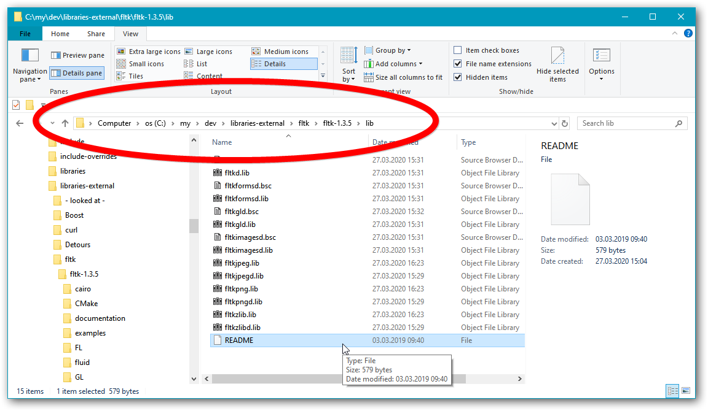
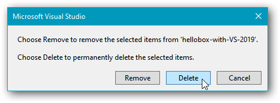

# Install FLTK for use with Visual C++

Bjarne Stroustrup’s C++ book for beginners, [“Programming: Principles and Practice Using C++”](https://www.amazon.com/Programming-Principles-Practice-Using-2nd/dp/0321992784), uses the [FLTK library](https://www.fltk.org/) for simple graphical user interfaces (GUI).

I show how to install and use the library with Visual C++ 2019, both for the Windows command line and with use in Visual Studio.

The simplest way to install something for just Visual Studio use can often be to use the [vcpkg](https://github.com/microsoft/vcpkg) **package manager**, but here I use a **manual installation**. The advantage of a manual installation is that you have more control, including that you can then easily use the library in the command line (particularly relevant in order to test code with more than 1 compiler, which is generally a Good Idea™). The main cost is that it’s more work.

This is not a 1-2-3 cookbook recipe.

It’s documentation of how I actually did it, and what I thought as I did it.

---

<!-- START doctoc generated TOC please keep comment here to allow auto update -->
<!-- DON'T EDIT THIS SECTION, INSTEAD RE-RUN doctoc TO UPDATE -->
**Table of Contents**  *generated with [DocToc](https://github.com/thlorenz/doctoc)*

- [1. Find the library.](#1-find-the-library)
- [2. Download & check things.](#2-download--check-things)
- [3. Build the library with Visual Studio 2019.](#3-build-the-library-with-visual-studio-2019)
- [4. Make the library generally available for use.](#4-make-the-library-generally-available-for-use)
- [5. Build a small FLTK program in the command line.](#5-build-a-small-fltk-program-in-the-command-line)
- [6. Build a small FLTK program via a Visual Studio project.](#6-build-a-small-fltk-program-via-a-visual-studio-project)
- [7. Display minimal text and graphics in a general window.](#7-display-minimal-text-and-graphics-in-a-general-window)

<!-- END doctoc generated TOC please keep comment here to allow auto update -->

## 1. Find the library.

I ask Google to find “fltk”. It finds [https://www.fltk.org/](https://www.fltk.org/), as well as more specific pages, a Wikipedia article about it, etc.

I take a look at the FAQ there and discover that the latest *stable* version as of 27ᵗʰ March 2020 is FLTK 1.3.5; that this version “includes full UTF-8 Unicode support”, so nice!; and that “*Development of FLTK-1.3.5 has now stopped. All new development and bug fixing is focused on FLTK-1.4.x*”, which means that if I were installing this library for my own use then I would go for the new and simpler 1.4 version, even though it’s not regarded as stable.

I suspect that the book is based on the earlier 1.3.* version line. I check my PDF copy of the book, which I use to answer questions about it. The PDF specifies FLTK version 1.1.*, which is pretty old, but the PDF is of the first edition of the book, from 2009. Version 1.3.5 will have to do. If the book’s code is incompatible then it’s easier to adjust that code than to deal with a very old archaic library version with ditto archaic dependencies.

## 2. Download & check things.

The FLTK site’s downloads section lists a number of available v. 1.3.5 downloads:

> | Filename | Size | MD4 sum |  
> |----------|------|---------|  
> | fltk-1.3.5-source.tar.bz2   | 4393k   | 0de2b45a1896be2b4a8cafae89b84248 |  
> | fltk-1.3.5-source.tar.gz    | 5139k   | e85017defd5a03ae82e634311db87bbf |  
> | fltk-1.3.5-docs-html.tar.gz | 7281k   | e6c2d644731e06c2274716b6ad017453 |  
> | fltk-1.3.5-docs-pdf.tar.gz  | 4836k   | d10738e7bb6b534d94771b37c8e92af3 |  

The two first look like the same archive compressed with different tools. To choose between them I google “bz2 versus gz”. I discover that they’re functionally equivalent. Windows can probably not handle these formats but I have installed the free program [**7Zip**](https://www.7-zip.org/). It’s amazingly good, enough that I stopped using WinZip which I had a paid license for.

So, downloading the smallest source archive, “fltk-1.3.5-source.tar.bz2”, as well as the PDF variant of the docs, “fltk-1.3.5-docs-pdf.tar.gz”. The PDF is preferable to the HTML because it *doesn’t* display in a browser instance and because if it’s done properly it will have a clickable table of contents available on the side in the viewer (I use [**Sumatra**](https://www.sumatrapdfreader.org/free-pdf-reader.html)).

I use 7Zip to inspect the contents of these archives. Evidently the source is generally meant to be built with the help of [**CMake**](https://cmake.org/), which happily I also have installed. The 7Zip archive viewer allows me to fire up a temporary unpacking of the user manual, conceptually viewing the PDF within the archive, and that PDF tells me that the library can be built with MinGW g++ and/or Visual C++ (I have both). That’s good, but it only talks about very old versions of these compilers, and old versions of Windows, which is not good. However, it notes that

> **”** More up-to-date information for this release may be available in the file "README.MSWindows.txt" and you should read that file to determine if there are changes that may be applicable to your build environment.

The latest compiler version mentioned in the "README.MSWindows.txt" file is VisualStudio 2010, which is not a good sign. If there are version dependencies to justify mentioning specific versions, then instructions (not to mention code) for a 10 year old version may be problematic. Some Adapation Required™, probably.

I use 7Zip to unpack the archives to a new subfolder in my general external C++ libraries folder, `"c:\my\dev\libraries-external\fltk"`. For both archives double unpacking is necessary: first unpacking the outer archive, and then also an inner archive. This creates a subfolder “fltk-1.3.5”, with the documentation placed in a subfolder of that again, called “documentation”.

## 3. Build the library with Visual Studio 2019.

Since building the library from Visual Studio is supported, and since that will probably create folders for build files and binaries, a folder framework that can be reused for MinGW g++, I choose to do a Visual Studio based build first.

The "README.MSWindows.txt" file says

> ~~~txt
> Configuring FLTK
> ------------------
>
> Launch VisualStudio. Open the project file in
>
>   ...\fltk-1.3.xxxx\ide\VisualC2010\fltk.sln
> ~~~

A simpler way is to just double-click that file, which should launch Visual Studio. However, if one has several versions installed one may want to do the suggested two steps. Since I have deleted all earlier versions of Visual Studio I just double-click the file; in my filesystem “c:\my\dev\libraries-external\fltk\fltk-1.3.5\ide\visualc2010\fltk.sln”:

Visual Studio launches, in its own unmistakable worm-struggling-in-syrup way, and pops up a project version conversion dialog:

I don’t plan on installing any older Visual Studio version, and the FLTK sources are always available to start from scratch again if necessary, so I just click OK. There is a progress box with a frantic progress meter. It’s quickly over: successful conversion.

The "README.MSWindows.txt" file now says one should build the “demo” project, and that’s already set as startup project (marked in bold in Visual Studio’s project list). So I just hit **`Ctrl`+`F5`** to build and run it. I hurry to press the `Print Screen` key to take a screenshot of the initial build progress message text in the output pane:

There’s evidently a lot of building for Visual Studio to do, so I go make a cup of coffee.

When I return a number of console windows are flashing into existence and disappearing just as quickly, and then suddently one remains, accompanied by a more GUI-like window from the same program:

The "README.MSWindows.txt" file says about this,

>     Use "Demo" to explore all test programs.

So I explore a few things. It works. But the look and feel of this is old-fahsioned gray and square-ish pre-Vista,

However, in one’s own programs a modern look and feel can probably be easily specified, though with Windows-specific code and tool usage. Weasel-word “probably” because if FLTK is doing its own drawing of buttons etc., then the only look and feel adjustments available will be those that the library itself supplies. Another problem I notice, that curves and diagonal lines are not anti-aliased, i.e. they’re not smooth but with noticeable square pixels:

However, I see that there’s a Cairo sub-folder and a Cairo demo-program, and Cairo is a 2D graphics library that I know can do anti-aliasing (it’s also the basis of the only serious proposal for a standard C++ graphics library). So I set that project as active in Visual Studio, and try to run it. However, that just pops up an error box:

Searching for “cairo” in the "README.MSWindows.txt" file doesn’t turn up any hits.

So, I google “fltk cairo”. The first hit leads to [“Cairo Support Functions and Classes - FLTK 1.3.5”](https://www.fltk.org/doc-1.3/group__group__cairo.html) in the FLTK 1.3.5 documentation. The text there mentions “when `FLTK_HAVE_CAIRO` is defined”. Thus I google “FLTK_HAVE_CAIRO”. The fourth hit [“README.Cairo.txt in rtems-graphics-toolkit/fltk-1.3.0 – RTEMS Project”](https://devel.rtems.org/browser/rtems-graphics-toolkit/fltk-1.3.0/README.Cairo.txt?rev=0b5c02986d97074cfa1bf635650f44cfd961495d) looks promising. The text there mentions that

>     37   Configuration
>     38  ---------------
>     39  
>     40  All the changes are *inactive*  as long as the new configuration
>     41  option --enable-cairo is not added to the configure command.
>     42  For non configure based platforms/ide, the FLTK_HAVE_CAIRO preprocess var.
>     43  has to be defined.
>     44  All configure based build files has now this feature integrated,
>     45  also vc2005 build files have 2 new build modes "Release Cairo" and
>     46  "Debug Cairo".
>     47  Others IDE's will be updated progressively.

Oh! Build modes for Visual Studio! Convenient!

After selecting the with-Cairo release mode I press `Ctrl`+`F5` to rebuild and run, and I plan to go to make a new cup of coffee (writing this all up takes much time, and also building takes time). However, as I type in the final period of that sentence I notice that the build activity has stopped. There’s been a build error!

~~~txt
4>Build started 27.03.2020 16:23:18.
4>Target PrepareForBuild:
4>  C:\Program Files (x86)\Microsoft Visual Studio\2019\Community\MSBuild\Microsoft\VC\v160\Microsoft.CppBuild.targets(459,5): warning MSB8028: The intermediate directory (Release Cairo\) contains files shared from another project (fltkjpeg.vcxproj, fltkpng.vcxproj).  This can lead to incorrect clean and rebuild behavior.
4>  Creating directory "Release Cairo\fltk.tlog\".
4>Done building target "PrepareForBuild" in project "fltk.lib.vcxproj".
4>Target InitializeBuildStatus:
4>  Creating "Release Cairo\fltk.tlog\unsuccessfulbuild" because "AlwaysCreate" was specified.
4>Target PreBuildEvent:
4>          1 file(s) copied.
4>Target ClCompile:
4>  case.c
4>  fl_call_main.c
4>  fl_utf.c
4>  flstring.c
4>  is_right2left.c
4>  is_spacing.c
4>  numericsort.c
4>  scandir.c
4>  vsnprintf.c
4>  Generating Code...
4>  filename_absolute.cxx
4>  filename_expand.cxx
4>  filename_ext.cxx
4>  filename_isdir.cxx
4>  filename_list.cxx
4>  filename_match.cxx
4>  filename_setext.cxx
4>  Fl.cxx
4>  C:\my\dev\libraries-external\fltk\fltk-1.3.5\FL\Fl_Cairo.H(32,11): fatal error C1083: Cannot open include file: 'cairo.h': No such file or directory
4>  Fl_abort.cxx
~~~

Uh oh. Well I’ll have that coffee anyway, first. :)

In the kitchen I realize that fixing the Cairo support isn’t a priority for novices trying to use the FLTK library with Bjarne’s C++ book. Discussing the Cairo support would just be a fruitless long digression. So I just mention that it will involve either changing the project’s include path specification, or adding a suitable junction or symlink to the Cairo include header folder, somewhere where it will be found by the compiler. Possibly it will also involve making a Cairo DLL available to the programs. So it can conceivably be much to discuss, so I decide to not do that.

Now, where did the first build put the binaries?

Checking the properties of the first demo program project, “adjuster”, there’s nothing in the project’s library search path, but I find something in the linker settings:

~~~txt
..\..\lib;%(AdditionalLibraryDirectories)
~~~~

I.e. up two levels from the project folder there should be a “lib” folder, and there is, and it contains a “README” file:

~~~txt
README.lib
----------

This README file is a placeholder for library files on your
system.

Under Microsoft Windows a successful build of all projects and
configurations will contain debug and release libraries for you
to link to - all are built using the multi-threaded DLL
settings.  The DLL files (fltkdll.dll and fltkdlld.dll) required
for a complete DLL-based binary distribution are located in the
"visualc" directory.

Under UNIX a single set of library files will be built, with or
without debug information depending on the options you provided
to the configure script.
~~~

The “**d**” at the end of the filenames, like “fltkd.lib”, says that these binaries are from a debug build. Release build binaries simply have no suffix, e.g. the more clean filename “fltk.lib”. With command line builds of small programs one will typically want to use the clean names with no difficult-to-remember suffix mess (it can be and usually is very much more complicated than the simple “d” suffixes here), so I now build also release versions.

To just build the whole solution I use Visual Studio keypress `Shift`+`Ctrl`+`B`.

## 4. Make the library generally available for use.

Different versions and variants of Visual C++, such as the 32-bit versus the 64-bit compiler, generally produce and require different binaries, incompatible binaries. The “lib” folder + filename structure established by the Visual Studio build here is therefore not sufficient to use this library simultaneously with different versions or variants of Visual C++. It is good enough to use with both one Visual C++ compiler and one MinGW g++ compiler, because a Visual C++ static library “foo” is named “foo.lib”, while the same library with g++ is named differently, “libfoo.a”. But even if that’s probably how most students will use it I decide to do things properly. That is, I decide to support the general use case of multiple versions and variants of various compilers.

The two main schemes are to encode the specifics of a binary in its filename, or to place the binaries in a folder hierarchy that reflects this information. I use a combined approach with debug versus release encoded in the filenames. So, first I move the generated binaries to a folder for Visual C++ 2019 32-bit binaries, “C:\my\dev\library-binaries\msvc-2019\32-bit”:

Then I attempt to build also 64-bit binaries of all the “fltk…” projects, after creating a 64-bit toolset configuration in the Visual Studio solution:

But Visual Studio now generates multiple errors about not being able to access the debug information file, a.k.a. program database, that it itself generates. Something ungood (I suspect a bug in the VS implementation of parallel builds), so I decide to not waste time and space on this either. I.e. no Cairo support, and no 64-bit binaries.

Now for include paths, the second main aspect of using a library.

In Visual Studio I check the source code of the first example program, to see how the library headers are included, and they’re apparently intended to be included via a folder “FL”:

~~~cpp
    ⋮
#include <stdlib.h>
#include <FL/Fl.H>
#include <FL/Fl_Double_Window.H>
#include <FL/Fl_Adjuster.H>
#include <FL/Fl_Box.H>
    ⋮
~~~

Usually a library’s headers are in an “***include***” folder, so I expect to find the “FL” folder as a sub-folder of an “include”. But it’s just directly there in the library’s main folder. Unconventional, but OK:

One way to use this in a VS project is to include the parent folder path, the library folder path, in the VS project’s include search path. With this I believe most common approach one adds at least one such path per library, and that’s extra work that I can very well do without, thank you. Instead I use just *one* include folder, where I put junctions (they’re like symbolic links, but you can create them without configuring Windows for development) to the relevant folders:

~~~txt
[C:\my\dev\include]
> mklink /j FL C:\my\dev\libraries-external\fltk\fltk-1.3.5\FL
Junction created for FL <<===>> C:\my\dev\libraries-external\fltk\fltk-1.3.5\FL

[C:\my\dev\include]
> dir FL /b | find "abi"
abi-version.h
~~~

Regarding the “abi-version.h” file, the “README.MSWindows.txt” has this to say:

~~~txt
 Installing FLTK
-----------------

The default location for VisualC 2008 libraries and headers is here:

  C:\Program Files\Microsoft Visual Studio 9.0\VC\

It is possible to move the FLTK libraries, headers, and Fluid into the
respective subdirectories, so that they are available for future development
without adding link and include paths to the solution.

  copy the entire FL directory into the include path

  add all files from ide\VisualC2008\FL to the FL directory copied above
    (this is currently only one file: abi-version.h)

  copy all .lib files from the fltk lib directory to the VC lib directory

  copy fluid.exe in the fluid directory to the bin directory

I highly discourage using dll's (dynamically linking libraries) on MSWindows
because they will require an installation process and likely cause version
conflicts. Use the static .lib libraries instead.
~~~

So for the headers it apparently remains to copy a real “abi-version.h” over the existing dummy one. However, there is no such directory as mentioned in the text above. And considering that all the demo programs compiled successfully this can’t be critical, so it's a third thing to ignore for now: no Cairo, no 64-bit, and no up-to-date ABI version spec.

## 5. Build a small FLTK program in the command line.

At this point about a nychthemeron passed for me, doing other things (including sleeping). As I tried to pick up the thread of my thoughts I decided that instead of the intended Visual Studio project I’d first of all do a simplest possible “Hello” program built in the command line. Because with a command line build one has full control.

I first look in the FTLK documentation PDF to find what its message box function is called. There turned out to no general message box function but a number of specialized ones, including `fl_alert` and `fl_message`, which look like they can be used in a “Hello” program. The same section of the documentation discusses the `fl_message_title` function used to specify the title of the next message box, which with most other GUI frameworks is a parameter.

Source code, where I’m just *assuming* that there will be an OK-button in the box:

[<small><i>hellobox/main.cpp</i></small>](source/hellobox/main.cpp)
~~~cpp
#include <FL/fl_ask.H>

auto main()
    -> int
{
    fl_message_title( "An FLTK message box" );
    fl_message( "%s\n", "Hello from FLTK!\nJust press the OK button, please." );
}
~~~

To use 32-bit Visual C++ directly in the command line, which is what I intend to do, three environment variables have to be properly defined:

* **`PATH`**  
  is a general Windows variable that specifies, separated by semicolons, the paths to the folders where a command interpreter should look for the compiler and other tools.
* **`INCLUDE`**  
  is a Visual C++-specific variable that specifies the paths to the folders where the compiler should look for header files, including standard library headers.
* **`LIB`**  
  is a Visual C++-specific variable that specifies the paths to the folders where the linker and librarian tool should look for compiled libraries, i.e. the binaries.

To define these I set up the environment by running — via a batch file — the command

    "%MSVC_PATH%"\vcvarsall.bat %bitness%

… where `MSVC_PATH` holds the path to the folder of Microsoft’s “**vcvarsall.bat**” file, e.g.

    C:\Program Files (x86)\Microsoft Visual Studio\2019\Community\VC\Auxiliary\Build

… and where `bitness` is either “x86” for the 32-bit compiler or “x64” for the 64-bit compiler; I specify “x86” this time.

My configuration batch file also sets up the environment variable **`CL`** which provides common options to the compiler, as

    /nologo /utf-8 /EHsc /GR /FI"iso646.h" /std:c++17 /Zc:__cplusplus /W4 /wd4459 /D _CRT_SECURE_NO_WARNINGS /D _STL_SECURE_NO_WARNINGS

After running the configuration, I add (using the Cmd `set` command)

* at the end of the `INCLUDE` value, “;c:\my\dev\include”, and
* at the end of the `LIB` value, “;c:\my\dev\library-binaries\msvc-2019\32-bit”:

~~~txt
[C:\my]
> set oi=%include%

[C:\my]
> set cpath=c:\my\dev\include

[C:\my]
> set include=%oi%;%cpath%

[C:\my]
> split-var include
C:\Program Files (x86)\Microsoft Visual Studio\2019\Community\VC\Tools\MSVC\14.24.28314\ATLMFC\include
C:\Program Files (x86)\Microsoft Visual Studio\2019\Community\VC\Tools\MSVC\14.24.28314\include
C:\Program Files (x86)\Windows Kits\NETFXSDK\4.8\include\um
C:\Program Files (x86)\Windows Kits\10\include\10.0.17763.0\ucrt
C:\Program Files (x86)\Windows Kits\10\include\10.0.17763.0\shared
C:\Program Files (x86)\Windows Kits\10\include\10.0.17763.0\um
C:\Program Files (x86)\Windows Kits\10\include\10.0.17763.0\winrt
C:\Program Files (x86)\Windows Kits\10\include\10.0.17763.0\cppwinrt
c:\my\dev\include

[C:\my]
> set olib=%lib%

[C:\my]
> set lib=%lib%;c:\my\dev\library-binaries\msvc-2019\32-bit

[C:\my]
> split-var lib
C:\Program Files (x86)\Microsoft Visual Studio\2019\Community\VC\Tools\MSVC\14.24.28314\ATLMFC\lib\x86
C:\Program Files (x86)\Microsoft Visual Studio\2019\Community\VC\Tools\MSVC\14.24.28314\lib\x86
C:\Program Files (x86)\Windows Kits\NETFXSDK\4.8\lib\um\x86
C:\Program Files (x86)\Windows Kits\10\lib\10.0.17763.0\ucrt\x86
C:\Program Files (x86)\Windows Kits\10\lib\10.0.17763.0\um\x86
c:\my\dev\library-binaries\msvc-2019\32-bit
~~~

The first change lets the compiler find the “FL/…” headers, and the second change lets the linker find the “fltk.lib” main library and other FLTK libraries.

In passing, `split-var` is my own little utility for displaying the semicolon-separated values of an environment variable. It’s trivial to implement in e.g. C++, but for pedagogical reasons in a writing effort I at one point did it as a Windows batch file, and that’s the one I have now. That’s *not* trivial, at least not if it’s done properly, so I don’t recommend wasting time on the batch file approach; just fire up your C++ or C# compiler if you want this utility.

The libraries that provide access to the Windows API will have to be specified in addition to “fltk.lib”, and a simple way is to just try to build, note the first linker error message, add the appropriate **import library** for the DLL that provides that function, and repeat:

~~~txt
[Y:\source\hellobox]
> cl main.cpp /MD fltk.lib /Fe"hello"
main.cpp
fltk.lib(fl_ask.obj) : error LNK2019: unresolved external symbol __imp__MessageBeep@4 referenced in function "void __cdecl fl_beep(int)" (?fl_beep@@YAXH@Z)
    ⋮
~~~

The hundreds of error messages after the first should just be ignored. If I didn’t already know that `MessageBeep` is a function provided by “user32.dll” I could have googled it and found that in e.g. Microsoft’s documentation. Visual C++’s import library for that DLL is called “user32.lib”, so I now try

~~~txt
[Y:\source\hellobox]
> cl main.cpp /MD fltk.lib /Fe"hello" user32.lib
main.cpp
fltk.lib(Fl.obj) : error LNK2019: unresolved external symbol __imp__CombineRgn@16 referenced in function "public: void __thiscall Fl_Widget::damage(unsigned char,int,int,int,int)" (?damage@Fl_Widget@@QAEXEHHHH@Z)
    ⋮
~~~

Again, if I didn’t already know that `CombineRgn` is a function provided by the GDI (graphics device interface) Windows API sub-library, I could have googled it. The DLL that provides that sub-library is “gdi32.dll”, and Visual C++’s import library for that DLL is “gdi32.lib”. So I now try

~~~txt
[Y:\source\hellobox]
> cl main.cpp /MD fltk.lib /Fe"hello" user32.lib gdi32.lib
main.cpp
fltk.lib(Fl.obj) : error LNK2019: unresolved external symbol __imp__OleInitialize@4 referenced in function "void __cdecl fl_open_display(void)" (?fl_open_display@@YAXXZ)
    ⋮
~~~

And so on, until finally the following succeeds:

~~~txt
[Y:\source\hellobox]
> cl main.cpp /MD fltk.lib /Fe"hello" user32.lib gdi32.lib ole32.lib advapi32.lib shell32.lib
main.cpp
~~~

Oh, I forgot to explain the `/MD` option: it specifies that the program should use the DLL version of the runtime library. It has to match the specification used when the FLTK library binaries were built. If it doesn't match you're likely to get linker errors.

Anyway, this has produced an executable “hello.exe” that I now run via command `hello`, which produces the following weird looking message box:

The button looks suspiciously like a custom-drawn old pre-Vista style Windows API button, which if so means that one may modernize the look. To check that I fire up the Spy++ inspector tool from Visual Studio’s tools menu. Unfortunately, Spy++ reports that there are no Windows controls within the window, it’s all drawn directly by FLTK:

So, the only quick improvement is in the source code, fixing the incorrect assumption about the button label.

I remember that the FLTK version description said that it’s Unicode-enabled, so I opportunistically add a smiley and use round non-ASCII quote signs, and I make sure that the source code is saved as UTF-8, and that Just Works™:

[<small><i>hellobox/main.v2.cpp</i></small>](source/hellobox/main.v2.cpp)
~~~cpp
#include <FL/fl_ask.H>

auto main()
    -> int
{
    fl_message_title( "An FLTK message box" );
    fl_message( "%s\n", "Hello from FLTK! 😃\nJust press the “Close” button, please." );
}
~~~

The executable in this build is a Windows console program, which means that

* the command intepreter waits for the program to finish, and
* if it’s run without a console window, then Windows will provide one.

To instead build it as a GUI program, i.e. with the GUI **subsystem** specified in the executable’s header, you can just add `/link /subsystem:windows` to the build command. Due to a peculiarity of Microsoft’s tools, with some other GUI framework you would have to add even more, namely `/entry:mainCRTStartup`, but FLTK fixes that for you. Technically, FLTK provides a `WinMain` function that satisfies the Microsoft linker and that (formally UB) calls the ordinary standard `main` function.

## 6. Build a small FLTK program via a Visual Studio project.

There are three main ways to reuse the above source code in a Visual Studio project:

* By copying the text to a new source file in the project.
* By including the original file, residing elsewhere, in the project, via its ordinary filesystem path.
* By using a junction or symbolic link within the VS project folder.

I generally use the third approach, also for projects originally started in Visual Studio, because that gives a clean **out of source** build with a VS solution that does not depend on any particular placement relative to the source. For example, all the megabytes of Visual Studio stuff can then easily be kept out of the source control (e.g. Github) system’s view. At least when one disables the relevant “let me do that for you” help-that-hinders functionality in Visual Studio.

To keep things simple here I decide to instead use the middle approach, with the Visual Studio solution in a different folder.

In Visual Studio I start by creating a GUI subsystem ordinary ordinary Windows desktop program, which in VS 2019 can be done e.g. via the “Windows Desktop Application” project template:

I create a new folder “build” to have the build(s) in, and choose a systematic project name, “hellobox-with-vs-2019”, so that it can easily be related both to the corresponding source code folder and the relevant build tools:

Visual Studio now presents a progress bar for an action that should be instantaneous.

After the progress bar has inanely progressed for half a minute or so, VS presents the created projected, complete with repulsive Microsoft style starter code for a Windows API level GUI program:

At this point I remember there there is another desktop program project template, that doesn’t produce all this undesired cruft. Oh well. Done is done.

Before removing the cruft I check out what on Earth the “framework.h” header is. It turns out that it just establishes macros that specify the targeted Windows version. That is much better done directly by defining `_WIN32_WINNT`.

The full list of cruft files to remove from the project and delete permanently is (with this version of Visual Studio)

~~~txt
framework.h
hellobox-with-VS-2019.cpp
hellobox-with-VS-2019.h
hellobox-with-VS-2019.ico
hellobox-with-VS-2019.rc
Resource.h
small.ico
targetver.h
~~~

Visual Studio will by default just remove the files from the project. I choose the “Delete” button to also delete the files. Usually that works fine, although sometimes Visual Studio gets confused and thinks that removed and deleted files are still part of the project (one effective remedy then is to edit the project configuration file as text, but I don’t need to do that now):

With the cruft gone I right click the project’s “Source Files” category (file categories misleadingly have folder icons) and select “Add” ▷ “Existing item…” in order to add the the previous section’s source code, the “main.v2.cpp” file.

Visual Studio’s IntelliSense immediately highlights three parts of the code with red curvy underlining:

 The error indicators come because I haven’t bothered to create a default include search path for new Visual Studio C++ projects. The include search path is specified in the project settings, which are edited as project *properties*. One way to those property sheets, the way I choose now, is to right-click the project and choose “Properties” at bottom in that long menu:

First I use the drop-down in the upper left of this dialog to tell it that I want to make changes to *all* configurations, not just “Release”:

Next, just because I usually use language features that were introduced in C++14 and C++17, I choose C++17 as C++ language standard:

In passing, the white window title, deactivation of the window while the apparent drop-down menu is there, is real, a silly-bug in Visual Studio.

Evidently someone decided to reinvent the wheel (a drop-down menu), and their new wheel was octagonal and a little bumpy, but sufficiently round to roll, if not exactly the rock ’n roll experience of a proper wheel.

In order to support code that checks the C++ standard version via `__cplusplus`, with Visual C++ it’s necessary to use option `/Zc:__cplusplus`. This option can’t be selected via the GUI in Visual Studio 2019. And so I go the “Additional Options” field for the result command line, where I can type in this option plus any others I want, like `/utf-8`:

The **`/utf-8`** option is **critical** for the code used in this project, because it ensures that string literals are encoded with UTF-8. I.e., it sets UTF-8 as the C++ “execution character set”. It *also* instructs the compiler to assume by default that source code is UTF-8 encoded.

Also critical, to set the include search path, the library search path, and use of the FLTK library.

To edit the include search path I click on the down arrow to the right in the field, which (it’s silly) drops down a menu with just one item, “Edit…”:

Since I use a single common include directory I only have to type in “c:\my\dev\include” here:

And likewise for the libraries search path, I only have to type in “c:\my\dev\library-binaries\msvc-2019\32-bit” here, and after clicking OK it looks like this:

The FLTK library needs to be specified separately for the release and debug configurations, as respectively “fltk.lib”  and “fltkd.lib”, because with Visual C++ the main program’s runtime library specification has to match the runtime library specification used when building the library binaries, release or debug:

And that’s it regarding the critical stuff, the settings necessary to get this to compile and run. In addition I use to up the warning level and enable language features such as RTTI, plus, when that’s relevant, turn off use of precompiled headers. Happily this project template didn’t set up use of precompiled headers.

Now, having OK-ed away the dialog, I try to build by pressing `Ctrl`+`Shift`+`B`. I expect some Windows API sub-libraries to be missing. But otherwise it should be OK.

Unexpectedly the build succeeds all the way:

I try to run it via `Ctrl`+`F5` and that works too, but unexpectedly a console window pops up:

I now recall reading something about FLTK *producing a console window* in debug builds. To test this I rebuild in release mode, and run it. Now, happily, there’s no console window, but instead there’s an unexpected avalanche of warnings about missing debug information:

I choose “Build” “Clean solution”, and rebuild, but get the same avalanche of warnings. There’s one warning for each object file in the library.

~~~txt
fltk.lib(case.obj) : warning LNK4204: 'Y:\build\hellobox-with-VS-2019\Release\vc142.pdb' is missing debugging information for referencing module; linking object as if no debug info
~~~

I google the warning id, “LNK4204”, and discover that it’s a not uncommon problem and happens when the same debug information file name is used for two or more link units. The problem didn’t manifest for the debug build because the debug binaries of FLTK have uniquely named debug information files, like “fltk.pdb”, specified for the debug configuration in the FLTK Visual Studio project. And the problem didn’t manifest with the earlier command line build because that build did not specify creation of debug information.

So, a possible **workaround kludge**, a.k.a. a **stopgap measure**, is to just turn off creation of debug information in a release build of the program. This will effectively mean no debugging of the release build executable, which is why it’s a workaround and not a solution. But hey, debugging is what a debug build is for, and *that* works nicely without warnings, so I now just turn off that pesky debug information generation for release builds.

That is, I try to do that, but because I was able to apparently reproduce the warning avalanche in the command line by adding just compiler option `/Zi` (generate a debug information file, please), at first I mistakenly turn that off in the project settings. It has no effect. I then realize that all these warnings, even though there are two bunches of them, are *linker warnings*, so it has to be some linker option, and it is; I now turn off the option that makes the linker generate debugging information:

To test that I choose “Build” ▷ “Rebuild Solution”, and hurray, it works, no warnings!

A *solution*, instead of this workaround, would entail changing the release configuration project settings of the FLTK library projects so that uniquely named debug information files are generated also for the release build binaries, and rebuilding FLTK. I decide to not do that for this guide/tutorial/write-up. Enough is enough, already!

## 7. Display minimal text and graphics in a general window.

For GUI programming there are two levels of “Hello, world!”:

* Present a message box, which establishes
  - how to build and run a program with the chosen GUI library, and  
  - communication program → user.
* Present text and graphics in a general window with a menu, which establishes
  - how to do general windowing, graphics and text, and  
  - communication user → program.

I have usually used a dynamic ellipse program for the second “Hello, world!” level. This program presents a resizable window with an ellipse that fills out the window’s **client area**, the area where a traditional window presents things, as opposed to the title bar, menu bar and window frame areas. In Windows 10 it can look like this:

In the above API-level program I added some short code to use a more reasonable-looking readable font for the text, which was pretty ungood-looking by default, but I did nothing about anti-aliasing the ellipse. So the ellipse has the same kind of jagged look as produced by FLTK without Cairo. Corresponding to how one may use Cairo with FLTK, for the Windows API one may use e.g. its GDI+ graphics, but with both FLTK and the API level that fix entails much complication.

With FLTK the look of the text in the window is OK, but the font used for its menus could very well have been better. I decide to not do anything about it. So it looks like this:

For the Windows API level program coding I encounter two main issues: that `WM_SETFONT` doesn’t seem to work with a basic dialog window, and that `DrawTextA` doesn’t work correctly with UTF-8 as the process codepage, so that I have to use the UTF-16 based `DrawTextW`, with conversion of the program’s text from UTF-8 to UTF-16 encoding.

For the FLTK program coding I similarly encounter some issues, in particular that `fl_translate` appears to have no effect. I surmise that it may be that it has no effect on graphics operations with integer coordinates. But I decide to not check that.

Another issue with FLTK:

* I had to define the preprocessor symbol `WIN32`.

Possibly that was because I built the program in the command line. For while a Visual Studio project may (or may not) define `WIN32`, the compiler itself doesn’t. The FLTK programmers should have used `_WIN32`, not `WIN32`…

A third issue was that I now got an avalanche of warnings from the FLTK library’s own source code. Visual C++ has an experimental feature to turn off warnings for headers from a specific folder, but this gives very verbose commands and doesn’t (yet) work with junctions such as my “FL” junction in my general include folder. So I chose to simply ask the compiler to not show these warnings, regardless of where they occurred.

The FLTK code:

[<small><i>simple-graphics/using_fltk/main.cpp</i></small>](source/simple-graphics/using_fltk/main.cpp)
~~~cpp
#include <string>
using   std::string, std::to_string;

#include <FL/Fl.H>              // “All programs must include the file <FL/Fl.H>.”

#include <FL/Fl_Box.H>          // Fl_Box
#include <FL/Fl_draw.H>         // drawing functions
#include <FL/Fl_Menu_Item.H>    // Fl_Menu_Item
#include <FL/Fl_Menu_Bar.H>     // Fl_Menu_Bar
#include <FL/Fl_Window.H>       // Fl_Window

using C_str = const char*;

class Main_window:
    public Fl_Window
{
    ~Main_window() override = default;      // Prevents direct instantiation. Not perfect.

    static void callback_for_command_quit( Fl_Widget* menubar, void* )
    {
        menubar->top_window()->hide();      // Destroys window and terminates event loop.
    }

    static auto default_menuitems()
        -> const Fl_Menu_Item*
    {
        static const Fl_Menu_Item the_items[] =
        {
            { "&App", 0, 0, 0, FL_SUBMENU },
                { "E&xit", FL_COMMAND + 'q', &callback_for_command_quit },
                { 0 },
            { 0 }
        };
        return the_items;
    }

    class Client_area:
        public Fl_Box
    {
        void draw() override
        {
            fl_push_clip( x(), y(), w(), h() );
            {
                const string text = string()
                    + "Hello, world! 😃\n"
                    + "This client area is " + to_string( w() ) + "×" + to_string( h() ) + " pixels.";
                fl_color( FL_RED );
                const int stroke_width = 12;
                fl_line_style( 0, stroke_width, nullptr );
                fl_arc( x(), y(), w(), h(), 0.0, 360.0 );
                fl_color( FL_BLACK );
                fl_draw( text.c_str(), x(), y(), w(), h(), FL_ALIGN_CENTER, nullptr, 0 );
            }
            fl_pop_clip();
        }
        
    public:
        using Fl_Box::Fl_Box;
    };

    Fl_Menu_Bar*    m_menu_bar;
    Client_area*    m_client_area;

public:
    Main_window( const int width, const int height, const C_str title ):
        Fl_Window( width, height )
    {
        copy_label( title );

        m_menu_bar = new Fl_Menu_Bar( 0, 0, w(), 22 );
        m_menu_bar->copy( default_menuitems() );
        
        m_client_area = new Client_area( 0, m_menu_bar->h(), w(), h() - m_menu_bar->h(), "" );
        resizable( m_client_area );     // Omit this call to make the /window/ fixed size.

        end();  // End of being the default parent for new widgets.
    }
};

auto main()
    -> int
{
    (new Main_window( 340, 180, "FLTK dynamic ellipse" ))->show();
    return Fl::run();
}
~~~

The Windows API level code for a functionally equivalent program turned out to be roughly twice the number of lines. It’s also perhaps more difficult to grok, and it is of course system-specific while the FLTK code is in principle portable (I chose to not use time on testing it in a virtual box). On the other hand, the API-level code produces a better looking result, and, paradoxically for a GUI framework, with the API level code it’s much easier to add more menu items and code that handles them.

Building with Visual C++ in the command line:

~~~cpp
[Y:\source\simple-graphics\using_fltk]+
> set ANTIWARN=/wd4100 /wd4244 /wd4458

[Y:\source\simple-graphics\using_fltk]+
> cl /MD %ANTIWARN% main.cpp fltk.lib user32.lib gdi32.lib ole32.lib advapi32.lib shell32.lib -D WIN32 /Fe"demo"
main.cpp
~~~
